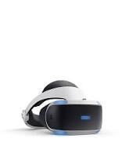
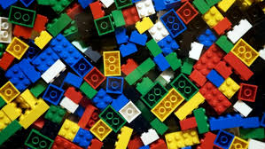

---
---

<link rel="stylesheet" href="styles.css" type="text/css">

I am Kevin Osorio, a student at [Miami Dade College](https://www.mdc.edu), majoring in _Mechanical Engineering_. 

Check my Summer Research Project (SRI) in the projects tab, and feel free to contact me if you have any questions. 

Some of my interest include:

## Virtual Reality

- In the spectrum of technological advancement,   Virtual Reality (VR) has sparked my interest and ever since I have build an engineering foundation to pursue that field. Virtual Reality has been progressing tremendously; PlayStation for now has VR Project Morpheus which enhances the gaming expereince for the individual. I would like to work on VR and one day submerge into the digital world and be able to do the imposibble.

## LEGO
- I passionately enjoy building and constructing anything creative. My passion started at the age of 5 when I was obsessed with LEGOs and would build some of the most interestng appartus. My imagination was wild.

## Innovation

- I hope one day to build a virtual world where everyone can play my favorite card game in the world: YU-GI-OH
and be able to see the actual cards in action and relieve the most amazing childhood memories of watching the TV Show.
